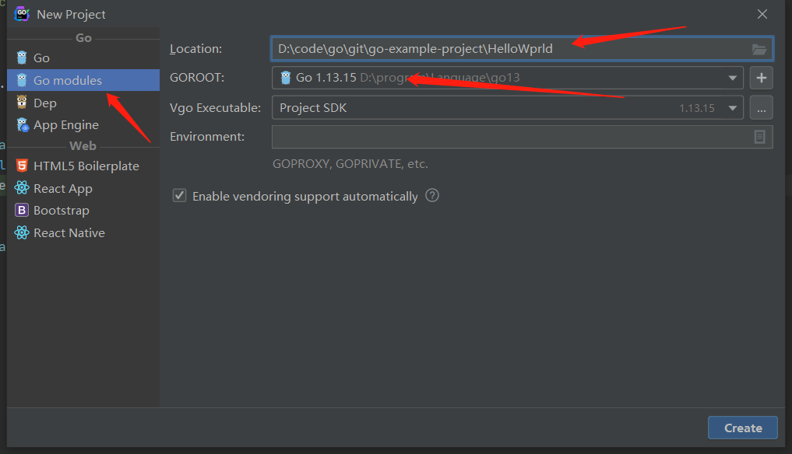
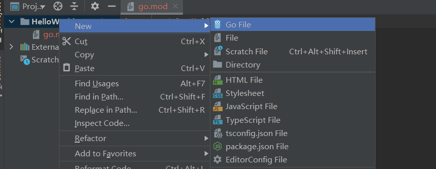
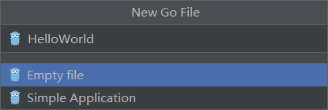

将软件系统模块化是一种常用且有效降低系统复杂性的方法。无论是现在流行的微服务架构，还是Java中的package、Class都践行了模块化的思想，只是粒度不同。Go提供了一种比package还要大一级别的模块化的机制——Go modules.

## 1、模块定义

Go中的一个模块可以简单的理解为是若干个包和一个`go.mod`文件。这里的包类似于Java中的package，而`go.mod`文件中记录了该模块的名称、版本、Go语言的版本、依赖的模块，如下所示：

```go
module github.com/LyricTian/gin-admin/v7  //模块名称

go 1.14      //go语言版本

require (
  github.com/LyricTian/captcha v1.1.0  //依赖的其他模块
  github.com/LyricTian/gzip v0.1.1
  github.com/LyricTian/queue v1.2.0
  github.com/alecthomas/template v0.0.0-20190718012654-fb15b899a751
  github.com/casbin/casbin/v2 v2.4.1
)
```

## 2、创建模块

接下来演示使用Goland创建自己的模块。并跑通Hello World。

依次点击file -> new -> project将出现如下界面：



选择Go modules,填写项目所在路径及名称。然后点击创建。这样项目就创建成功了。

然后如下所示新键文件：



然后填写文件名称，选择Simple Application.如下图所示：



在main函数中添加如下代码：

```go
package main

import "fmt"

func main() {
   fmt.Printf("Hello World!")
   
}
```

点击运行按钮，就可以看到输出结果。现在我们创建了自己的模块。

## 3、开放接口

现在重新回顾一下模块的作用，构建一个复杂系统时，将系统划分为多个模块，每个开发者只需要专注于少量的几个模块。其他模块只需要知道有哪些接口可以调用，以及这些接口实现的功能就行。而不是需要了解系统的所有细节，这样对开发者来说，大大降低了系统的复杂性。

从上文的回顾中可以看出，有些模块会开放一些接口供其他模块调用。开放的对立面是隐藏。一个好的模块绝不是把所有的细节暴露出来，而是开放一些实用的接口，隐藏掉大量实现细节。开放与隐藏就涉及到模块中代码的访问权限控制。

模块中首字母大写的函数、结构体、接口可以被其他模块访问。因此，我们对刚刚创建的模块进行改造，新增一些可以访问的结构体和接口。如下所示：

```go
package myFirst

import "fmt"

func MyName() {
   fmt.Print("zhaos")
}

type people1 struct {
   name string
   age  int
}

type People2 struct {
   name string
   age  int
}

func learn1() {
   fmt.Println("learn1")
}

func Learn2() {
   fmt.Println("learn2")
}

type read1 interface {
   read1()
}

type Read2 interface {
   Read2()
}
```

## 4、上传模块

编写好的模块放在仓库中使用时更加方便。Java使用maven管理依赖，所有的依赖包会有各种专门的公有的仓库。Go并没有搭建这种公有仓库，直接将版本控制的git仓库作为模块仓库，例如github、码云以及自己搭建的版本控制库都可以存放自己的模块以便自己很方便的下载。这一部分将展示如何把自己的模块发布到自己的github上。

**github中新键仓库并上传代码**

一个github仓库只能用来存放一个模块。然后将代码上传到仓库中。需要注意的是：

- go.mod文件中的module声明要正确填写。

```
module github.com/CedrusZhao/goModule //CedrusZhao是github用户名，goModule是仓库名
```

从该仓库下载代码使用的地址如下：https://github.com/CedrusZhao/goModule.git。但是在Go module中，要去掉https://和后面的.git后缀。这样描述的模块表示v1或者v0版本，如果要描述之后的版本，还需要添加后缀，如下所示：

```
module github.com/CedrusZhao/goModule/v2
```

后面添加v2表示该模块的第二版本。

module的声明一定要正确填写，引用模块是该声明会被验证，填写错误，会导致报错。

**打上tag,并发布到仓库**

```
git tag v1.0.0
git push origin v1.0.0
```

## 5、引用模块

**下载依赖：**

```
go get -u github.com/CedrusZhao/goModule@v1.0.0
```

使用@可以直接指定依赖的版本。

**引用依赖**

```go
package main

import  "github.com/CedrusZhao/goModule"
func main() {
myFirst.MyName()//myFirst是包名
}
```

## 6、模块重命名

模块所在的仓库可能会发生迁移。当本地没有此模块的缓存时，代码中对此模块的引用将失效。模块的重命名机制可以解决这个问题。

例如某开源软件原来某个依赖的地址是`gitter.com/CedrusZhao/goModule v1.0.0` 后来该模块迁移到了github上。我下载此项目后，无法获取到该依赖。该软件的作者使用replace机制，在`go.mod`文件中添加如下：

```go
replace gitter.com/CedrusZhao/goModule v1.0.0 => github.com/CedrusZhao/goModule v1.0.0
```

箭头后面的依赖项是最新的依赖项。只需要添加此描述，Go在下载依赖，编译代码时，都会使用替代项。

